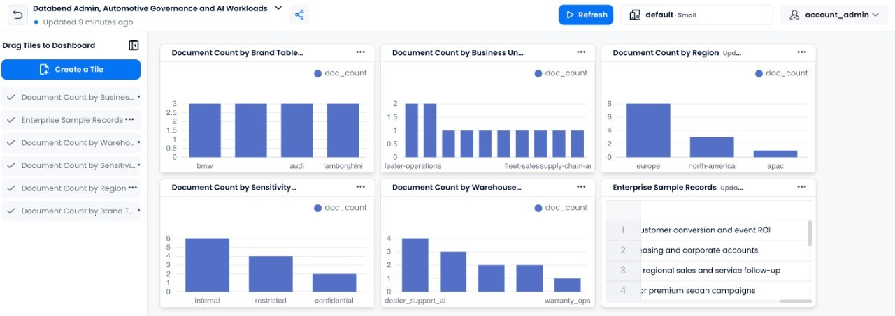

# databend-admin

Rust-native admin and governance toolkit for [Databend](https://www.databend.com/) environments, focused on RBAC, security posture, and warehouse performance visibility.

## In one sentence
`databend-admin` helps data teams inspect and manage [Databend](https://www.databend.com/) users, roles, grants, security posture, and warehouse/query health from a practical Rust-based control layer.

## Why this exists
Many enterprise data teams end up managing Databend environments through ad hoc SQL, tribal knowledge, and manual review. This project aims to make common administration workflows more consistent, auditable, and automatable.

## Initial scope
- live Databend-backed RBAC inventory for users, roles, and grants
- security posture checks for risky grants and stale or contractor-style accounts
- warehouse health snapshots
- CLI-first workflows with JSON and Markdown reporting

## Workspace
- `databend-admin-core`: admin domain types, policy checks, report generation
- `databend-admin-cli`: CLI entrypoint for inventory and report commands

## Planned command style
```bash
databend-admin rbac snapshot --format markdown
databend-admin security audit --format json
databend-admin warehouse health --format markdown
```

## Current commands
- `databend-admin rbac snapshot`
- `databend-admin security audit`
- `databend-admin warehouse health`
- `databend-admin ai vector-demo`

## Enterprise user journey example
A realistic target user is a large European automotive or industrial company onboarding multiple teams into Databend for manufacturing analytics, supply chain reporting, finance, and forecasting.

In that scenario, `databend-admin` gives the platform team a Rust-based admin layer to:
- inventory users, roles, and grants
- run security posture checks
- standardize onboarding reviews
- prepare for future warehouse-performance visibility

See `examples/USER_JOURNEYS.md` for fuller onboarding and enterprise usage examples.

## Rendered output examples

### RBAC snapshot example
```markdown
# RBAC Snapshot

## Users
| name | default role | disabled |
| --- | --- | --- |
| europe_sales_ops | sales_analyst | false |
| finance_exec_reporting | finance_reader | false |
| contractor_brand_review | brand_analyst | false |

## Grants
| role | object | privilege |
| --- | --- | --- |
| sales_analyst | database:cars_companies | SELECT |
| finance_reader | table:cars_companies.bmw_vector_docs | SELECT |
| admin | warehouse:global_analytics | ALL |
```

### Security audit example
```text
High: broad privilege on warehouse:global_analytics - Role admin holds ALL privileges on warehouse:global_analytics. Confirm this is intentional.
Low: review contractor account contractor_brand_review - Contractor-style accounts should be reviewed for expiry, least privilege, and ongoing need.
```

### Warehouse health example
```markdown
# Warehouse Health

| warehouse | size | running | auto suspend secs | auto resume |
| --- | --- | --- | ---: | --- |
| global_analytics | large | true | 300 | true |
| dealer_support_ai | medium | true | 120 | true |
| executive_brand_intelligence | medium | true | 180 | true |
| warranty_ops | small | false | 60 | true |
```

See `examples/OUTPUT_SAMPLES.md` and `examples/USER_JOURNEYS.md` for fuller usage and enterprise framing.

## Internal dashboard preview
The project also includes a Databend-native dashboard built on top of the sample automotive governance dataset.



Current dashboard widgets include:
- document count by brand table
- document count by business unit
- enterprise sample records table
- document count by warehouse
- document count by sensitivity
- document count by region

This dashboard currently lives inside a private Databend org environment, so the public repo uses a screenshot preview instead of a public dashboard link.

This makes the repo more than just a CLI concept. It now has:
- seeded Databend sample tables
- a Rust admin/governance toolkit
- a Databend-native dashboard preview
- and a stronger enterprise demo story

## Principles
- Rust-first and automation-friendly
- reportable before mutable
- safe admin workflows over dashboard theater
- enterprise credibility over hype

## AI and vectorized use cases
Databend is also relevant for AI-oriented and vectorized data workflows, so `databend-admin` should eventually help platform teams govern those environments too.

### Why this matters
In enterprise settings, vector and AI workloads create additional operational questions:
- who can access embedding or feature datasets
- which teams can read or write AI-related tables
- how warehouse usage changes under retrieval, inference, or hybrid analytics workloads
- whether access boundaries are still appropriate when structured and vectorized workloads coexist

### Example AI governance scenarios
These can now map directly to sample tables under `cars_companies`, including:
- `bmw_vector_docs`
- `volvo_vector_docs`
- `audi_vector_docs`
- `lamborghini_vector_docs`

#### 1. Global automotive knowledge retrieval
A large automotive company may store:
- product manuals
- dealer knowledge
- aftersales support content
- regional sales documents
- model and brand metadata

In a Databend environment supporting AI search or retrieval workflows, `databend-admin` can help teams reason about:
- who can access those datasets
- which roles can touch AI-related schemas
- whether contractor or temporary accounts still have access
- whether the same warehouses are being overloaded by reporting and AI-style workloads

#### 2. Sales and brand intelligence with vectorized data
For a Volvo-, BMW-, Lamborghini-, or Audi-scale analytics environment, teams may want to combine:
- continent / country / city sales analytics
- brand and model performance
- semantic search over internal documents
- AI copilots over operational data

That increases the need for:
- RBAC clarity
- warehouse visibility
- security reviewability
- operational control over mixed SQL + AI workloads

## Rendered AI-oriented examples

### Example AI workload policy questions
```text
- Which roles can access embedding tables for dealer-support search?
- Which warehouses are serving both finance dashboards and AI retrieval jobs?
- Are contractor accounts still able to query AI-related schemas?
- Do regional teams have the right brand-level data boundaries?
```

### Example enterprise positioning
```text
Databend-admin helps enterprise teams govern Databend environments that support both traditional analytics and emerging AI/vectorized workloads, with a focus on RBAC, security posture, and warehouse performance visibility.
```

### Rendered vector-demo output
```markdown
# AI Vector Demo

| id | region | country | brand | city | business unit | sensitivity | warehouse | similarity | topic |
| --- | --- | --- | --- | --- | --- | --- | --- | ---: | --- |
| doc-eu-de-berlin-bmw-incentives-q1 | europe | germany | bmw | berlin | dealer-operations | internal | global_analytics | 1.000 | Q1 dealer incentive escalation policy for premium sedan campaigns |
| doc-eu-se-stockholm-volvo-ev-safety-playbook | europe | sweden | volvo | stockholm | aftersales-support | internal | dealer_support_ai | 0.991 | EV safety messaging and service-advisor escalation guidance |
| doc-na-us-newyork-audi-dealer-support | north-america | united-states | audi | new-york | dealer-performance | internal | dealer_support_ai | 0.979 | Dealer performance support guide for regional sales and service follow-up |
```

### Rendered vector-demo JSON sample
```json
[
  {
    "id": "doc-eu-de-berlin-bmw-incentives-q1",
    "region": "europe",
    "country": "germany",
    "city": "berlin",
    "brand": "bmw",
    "business_unit": "dealer-operations",
    "document_type": "sales_policy",
    "sensitivity": "internal",
    "owner_team": "europe-sales-ops",
    "warehouse": "global_analytics",
    "topic": "Q1 dealer incentive escalation policy for premium sedan campaigns",
    "similarity": 0.99964243
  },
  {
    "id": "doc-eu-se-stockholm-volvo-ev-safety-playbook",
    "region": "europe",
    "country": "sweden",
    "city": "stockholm",
    "brand": "volvo",
    "business_unit": "aftersales-support",
    "document_type": "knowledge_base",
    "sensitivity": "internal",
    "owner_team": "nordics-service-ops",
    "warehouse": "dealer_support_ai",
    "topic": "EV safety messaging and service-advisor escalation guidance",
    "similarity": 0.99145013
  }
]
```
